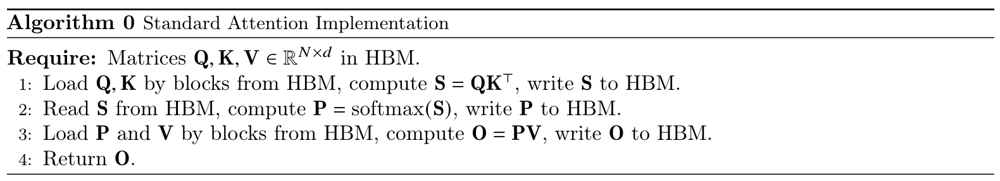
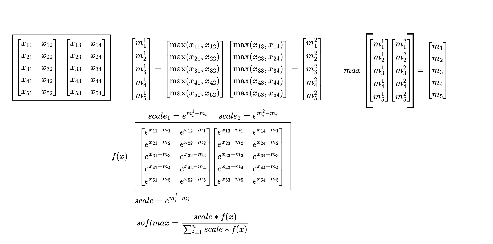

```python
import torch
import torch.nn as nn
import torch.nn.functional as F
```

# [Flash attention](https://readpaper.feishu.cn/docx/AC7JdtLrhoKpgxxSRM8cfUounsh)

Transformer 作为GPT类模型的基础架构提供了强大的特征处理能力，但是处理更长上下文仍然是一个挑战，因为核心的自注意力模块在序列长度上具有O(N^2)的时间和内存复杂度。 😓
这篇Flash Attention的工作深入硬件，新提出了一种具有IO感知的，快速的⚡️，节省内存的🧠，精确的🎯注意力算法。目前，Flash Attention已经集成至**torch2.0**

## 核心要点
- ⚡️为什么加快了计算？Fast
  - 降低了耗时的HBM访问次数。采用Tiling技术分块从HBM加载数据到SRAM进行融合计算。
- 🧠为什么节省了内存？Memory-Efficient
  - 不再对中间矩阵S，P进行存储。在反向的时候通过Recomputation重新计算来计算梯度。
- 🎯为什么是精准注意力？Exact Attention
  - 算法流程只是分块计算，无近似操作。

## Standard Attention Implementation
在注意力的一般实现中，对$\mathbf{Q}, \mathbf{K}, \mathbf{V} \in \mathbb{R}^{N \times d}$三个输入执行以下算法得到输出$\mathbf{O}$，其中softmax行级别执行。
$$
\mathbf{S}=\mathbf{Q K}^{\top} \in \mathbb{R}^{N \times N}, \quad \mathbf{P}=\operatorname{softmax}(\mathbf{S}) \in \mathbb{R}^{N \times N}, \quad \mathbf{O}=\mathbf{P} \mathbf{V} \in \mathbb{R}^{N \times d},
$$
在这个算法中，$\mathbf{S}, \mathbf{P}$矩阵都是很大，需要在HBM中实例化来进行存储，这样就会带来很多HBM的访问次数，最终体现到算法时间端到端较长的延迟。



## softmax改进

理论基础
在传统算法中，一种方式是将Mask和SoftMax部分融合，以减少访存次数。然而，FlashAttention则更加激进，它将从输入$\mathbf{Q}, \mathbf{K}, \mathbf{V}$到输出$\mathbf{O}$的整个过程进行融合，以避免$\mathbf{S}, \mathbf{P}$矩阵的存储开销，实现端到端的延迟缩减。然而，由于输入的长度$N$通常很长，无法完全将完整的$\mathbf{Q}, \mathbf{K}, \mathbf{V},\mathbf{O}$及中间计算结果存储在SRAM中。因此，需要依赖HBM进行访存操作，与原始计算延迟相比没有太大差异，甚至会变慢（没具体测）。
为了让计算过程的结果完全在SRAM中，摆脱对HBM的依赖，可以采用分片操作，每次进行部分计算，确保这些计算结果能在SRAM内进行交互，待得到对应的结果后再进行输出。
这个过程中，有一点需要注意的是，之前对于softmax的计算是以行为单位的，如下所示：
$$
m(x):=\max _i x_i, \quad f(x):=\left[\begin{array}{lll}
e^{x_1-m(x)} & \ldots & e^{x_B-m(x)}
\end{array}\right], \quad \ell(x):=\sum_i f(x)_i, \quad \operatorname{softmax}(x):=\frac{f(x)}{\ell(x)}
$$
当我们将输入进行分片后，无法对完整的行数据执行Softmax操作。这是因为Softmax函数在计算时需要考虑整个行的数据。然而，我们可以通过如下所示方法来获得与完整行Softmax相同的结果，而无需使用近似操作。
$$
\begin{aligned}
& m(x)=m\left(\left[x^{(1)} x^{(2)}\right]\right)=\max \left(m\left(x^{(1)}\right), m\left(x^{(2)}\right)\right), \quad f(x)=\left[\begin{array}{ll}
e^{m\left(x^{(1)}\right)-m(x)} f\left(x^{(1)}\right) & e^{m\left(x^{(2)}\right)-m(x)} f\left(x^{(2)}\right)
\end{array}\right], \\
& \ell(x)=\ell\left(\left[x^{(1)} x^{(2)}\right]\right)=e^{m\left(x^{(1)}\right)-m(x)} \ell\left(x^{(1)}\right)+e^{m\left(x^{(2)}\right)-m(x)} \ell\left(x^{(2)}\right), \quad \operatorname{softmax}(x)=\frac{f(x)}{\ell(x)} .
\end{aligned}
$$


```python
input  = torch.randn(1, 5, 5)
output = torch.nn.functional.softmax(input, dim=-1)
print(output)
```

    tensor([[[0.0152, 0.1583, 0.3008, 0.3653, 0.1603],
             [0.2560, 0.4479, 0.0961, 0.0220, 0.1780],
             [0.1330, 0.0715, 0.5134, 0.0288, 0.2533],
             [0.0429, 0.0966, 0.6844, 0.0379, 0.1381],
             [0.0322, 0.1192, 0.3882, 0.1119, 0.3486]]])
    

* 原始的softmax公式为 $$\operatorname{softmax}(\boldsymbol{x})_i=\frac{e^{\boldsymbol{x}_i}}{\sum_j e^{\boldsymbol{x}_j}}$$这里在代码中实现的时候通常会先减去最大值，然后计算指数，最后再归一化，这样做的目的是为了防止指数运算溢出。$$\operatorname{softmax}(\boldsymbol{x})_i=\frac{e^{x_i}}{\sum_j e^{x_j}}=\frac{e^{-m}}{e^{-m}} \frac{e^{x_i}}{\sum_j e^{x_j}}=\frac{e^{x_i-m}}{\sum_j e^{x_j-m}}$$


```python
def raw_softmax(x,dim=0):
    x_max = x.max(dim=dim, keepdim=True)[0] # 计算dim维度的最大值 max会返回最大值和最大值的位置
    x_exp = torch.exp(x - x_max) # 计算e的x - x_max次方
    x_sum = x_exp.sum(dim=dim, keepdim=True) # 计算dim维度的和
    return x_exp / x_sum # 计算softmax
print(raw_softmax(input,dim=-1))
```

    tensor([[[0.0152, 0.1583, 0.3008, 0.3653, 0.1603],
             [0.2560, 0.4479, 0.0961, 0.0220, 0.1780],
             [0.1330, 0.0715, 0.5134, 0.0288, 0.2533],
             [0.0429, 0.0966, 0.6844, 0.0379, 0.1381],
             [0.0322, 0.1192, 0.3882, 0.1119, 0.3486]]])
    

* 分块softmax  




```python
def split_softmax(input, dim=0,split_size=2):
    split_inputs = torch.split(input, split_size, dim=dim)
    def softmax(x,dim=0):
        x_max = x.max(dim=dim, keepdim=True)[0]
        x_exp = torch.exp(x - x_max)
        return [x_exp , x_max]

    outputs = []
    for split_input in split_inputs:
        outputs.append(softmax(split_input,dim=dim)) # 计算每个块的softmax分子和最大值 

    x_max = torch.cat([output[1] for output in outputs], dim=dim).max(dim=dim, keepdim=True)[0]  # 拼接每个块的最大值
    for i in range(len(outputs)):
        outputs[i][0] = outputs[i][0] / torch.exp(x_max - outputs[i][1]) # 计算每个块的softmax值
    output = torch.cat([output[0] for output in outputs], dim=dim) # 拼接每个块的softmax值
    return output / output.sum(dim=dim, keepdim=True)
```

## Pytorch Flash Attention使用 
这里torch2.0已经实现了flash attention,可以参考官方文档使用，这里以[官网](https://pytorch.org/docs/stable/generated/torch.nn.functional.scaled_dot_product_attention.html)的例子为例


```python
print('torch = ',torch.__version__)
!nvcc --version
```

    torch =  2.1.0
    nvcc: NVIDIA (R) Cuda compiler driver
    Copyright (c) 2005-2022 NVIDIA Corporation
    Built on Wed_Sep_21_10:41:10_Pacific_Daylight_Time_2022
    Cuda compilation tools, release 11.8, V11.8.89
    Build cuda_11.8.r11.8/compiler.31833905_0
    


```python
from torch.nn.functional import scaled_dot_product_attention
import time
# Optionally use the context manager to ensure one of the fused kernels is run
query = torch.rand(32, 8, 51200, 64, dtype=torch.float16, device="cuda")
key = torch.rand(32, 8, 51200, 64, dtype=torch.float16, device="cuda")
value = torch.rand(32, 8, 51200, 64, dtype=torch.float16, device="cuda")
```

差别很难测出来，可能需要在更大的训练上才能体现优势，torch现在默认是使用flash attention，如果需要使用原始的attention，可以设置torch.backends.cuda.sdp_kernel(enable_flash=False,enable_math=True,enable_mem_efficient=True)


```python
with torch.backends.cuda.sdp_kernel(enable_flash=True,enable_math=False,enable_mem_efficient=False):
    attn_output = scaled_dot_product_attention(query, key, value)
with torch.backends.cuda.sdp_kernel(enable_flash=False,enable_math=True,enable_mem_efficient=True):
    attn_output = scaled_dot_product_attention(query, key, value)
```

    time =  0.0 ms
    torch.Size([32, 8, 51200, 64])
    time =  1000.1659393310547 ms
    torch.Size([32, 8, 51200, 64])
    
