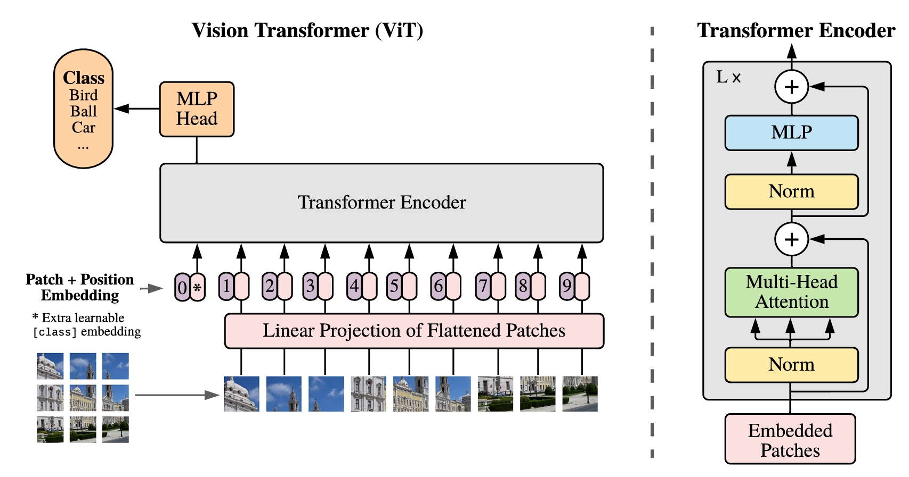
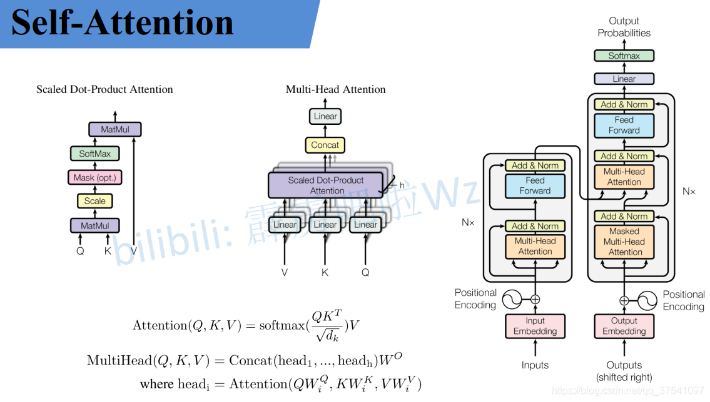

```python
import torch 
import torch.nn as nn
import torch.nn.functional as F
import math
from collections import OrderedDict
```

# [VIT结构解析](https://blog.csdn.net/qq_37541097/article/details/118242600)
## 1. VIT模型结构
  
VIT模型结构图如上所示，VIT模型由以下几个部分组成：
- **Patch Embedding**：将输入图像划分为固定大小的patch，然后将每个patch展平成一维向量，作为模型的输入。
- **Transformer Encoder**：将展平后的向量输入到Transformer Encoder中，进行特征提取和变换。
- **MLP Head**：将Transformer Encoder的输出通过一个全连接层进行分类。

## 2. Patch Embedding
Patch Embedding是将输入图像划分为固定大小的patch，然后将每个patch展平成一维向量，作为模型的输入。具体步骤如下：
- 将输入图像划分为固定大小的patch，例如16x16的patch。
- 将每个patch展平成一维向量，例如展平后的向量维度为256。


```python
# 以VIT Base为例
class PatchEmbedding(nn.Module):
    """
    2D Image 2 Patch Embedding
    """
    def __init__(self, img_size=224, patch_size=16, in_channels=3, embed_dim=768, norm_layer=None):
        super(PatchEmbedding, self).__init__()
        self.img_size = img_size
        self.patch_size = patch_size
        self.in_channels = in_channels
        self.embed_dim = embed_dim
        self.num_patches = (img_size // patch_size) ** 2

        # 用卷积来表示Patch Embedding,卷积核大小为patch_size,步长为patch_size,输出通道数为embed_dim
        self.proj = nn.Conv2d(in_channels, embed_dim, kernel_size=patch_size, stride=patch_size) 
        if norm_layer is not None:
            self.norm = norm_layer(embed_dim)
        else:
            self.norm = nn.Identity()

    def forward(self, x):
        B, C, H, W = x.shape
        assert H == self.img_size and W == self.img_size, \
            f"Input image size ({H}*{W}) doesn't match model ({self.img_size}*{self.img_size})."
        x = self.proj(x)  # (B, embed_dim, H//patch_size, W//patch_size)
        x = x.flatten(2).transpose(1, 2)  # (B, num_patches, embed_dim)
        x = self.norm(x)
        return x
```

## 3. Transformer Encoder
Transformer Encoder是由多个Encoder Block堆叠而成，每个Encoder Block包含两个子层：Multi-Head Attention和MLP。具体步骤如下：
- **Multi-Head Attention**：将输入的向量通过线性变换得到Query、Key、Value，然后计算注意力分数，最后将Query、Key、Value进行加权求和得到输出。




```python
class MultiHeadAttention(nn.Module):
    def __init__(self, embed_dim, num_heads, dropout=0.0):
        super(MultiHeadAttention, self).__init__()
        self.embed_dim = embed_dim
        self.num_heads = num_heads
        self.dropout = dropout

        self.head_dim = embed_dim // num_heads
        assert self.head_dim * num_heads == self.embed_dim, "embed_dim must be divisible by num_heads"

        self.qkv_proj = nn.Linear(embed_dim, 3 * embed_dim)
        self.out_proj = nn.Linear(embed_dim, embed_dim)

        self.dropout = nn.Dropout(dropout)

    def forward(self, x):
        B, N, C = x.shape
        qkv = self.qkv_proj(x).reshape(B, N, 3, self.num_heads, self.head_dim).permute(2, 0, 3, 1, 4)  # (3, B, num_heads, N, head_dim)
        q, k, v = qkv[0], qkv[1], qkv[2]  # (B, num_heads, N, head_dim)

        # Scaled Dot-Product Attention 
        attn = (q @ k.transpose(-2, -1)) / math.sqrt(self.head_dim)  # q:(B, num_heads, N, head_dim), k:(B, num_heads, head_dim, N) -> (B, num_heads, N, N)
        attn = attn.softmax(dim=-1)
        attn = self.dropout(attn)

        x = (attn @ v).transpose(1, 2).reshape(B, N, C)
        # attn:(B, num_heads, N, N) v:(B, num_heads, N, head_dim) -> (B, num_heads, N, head_dim) ->  (B, N, num_heads, head_dim) -> (B, N, C)
        x = self.out_proj(x)
        return x
```

- **MLP**：将输入的向量通过两个全连接层得到输出。


```python
class MLP(nn.Module):
    def __init__(self, in_features, hidden_features=None, out_features=None, act_layer=nn.GELU, drop=0.0):
        super(MLP, self).__init__()
        out_features = out_features or in_features # 如果有传入则为传入的值，否则为in_features
        hidden_features = hidden_features or in_features
        self.fc1 = nn.Linear(in_features, hidden_features)
        self.act = act_layer()
        self.fc2 = nn.Linear(hidden_features, out_features)
        self.drop = nn.Dropout(drop)

    def forward(self, x):
        x = self.fc1(x)
        x = self.act(x)
        x = self.drop(x)
        x = self.fc2(x)
        x = self.drop(x)
        return x
```

- **Encoder Block**：Transformer Encoder Block由两个部分组成，一个是Multi-Head Attention，另一个是MLP。在论文中，Multi-Head Attention后面接了一个Layer Normalization，然后MLP后面接了一个Layer Normalization，最后再接一个残差连接。


```python
class EncoderBlock(nn.Module):
    def __init__(self, embed_dim, num_heads, drop=0.0, act_layer=nn.GELU, norm_layer=nn.LayerNorm):
        super(EncoderBlock, self).__init__()
        self.norm1 = norm_layer(embed_dim)
        self.attn = MultiHeadAttention(embed_dim, num_heads, drop)
        self.drop = nn.Dropout(drop)

        self.norm2 = norm_layer(embed_dim)
        self.mlp = MLP(embed_dim, hidden_features=4*embed_dim, act_layer=act_layer, drop=drop)

    def forward(self, x):
        x = x + self.drop(self.attn(self.norm1(x)))  # Multi-Head Attention
        x = x + self.drop(self.mlp(self.norm2(x)))  # MLP
        return x
```

## 4. ViT模型搭建
ViT模型由Patch Embedding、Transformer Encoder和MLP Head组成。具体步骤如下：

- **Patch Embedding**：将输入的图像通过卷积层得到Patch，然后通过线性层得到Patch Embedding。
- **Transformer Encoder**：将Patch Embedding输入到Transformer Encoder中，得到输出。
- **MLP Head**：将Transformer Encoder的输出通过一个线性层得到最终的输出。

[nn.init.trunc_normal_讲解](https://blog.csdn.net/weixin_43135178/article/details/120622761)  
[dropout/droppath讲解](https://blog.csdn.net/qq_43135204/article/details/127912029?spm=1001.2101.3001.6661.1&utm_medium=distribute.pc_relevant_t0.none-task-blog-2~default~BlogCommendFromBaidu~Rate-1-127912029-blog-138034012.235%5Ev43%5Epc_blog_bottom_relevance_base9&depth_1-utm_source=distribute.pc_relevant_t0.none-task-blog-2~default~BlogCommendFromBaidu~Rate-1-127912029-blog-138034012.235%5Ev43%5Epc_blog_bottom_relevance_base9&utm_relevant_index=1)


```python
class ViT(nn.Module):
    def __init__(self, img_size=224, patch_size=16, in_chans=3, num_classes=1000, embed_dim=768, num_heads=12, drop=0.0, norm_layer=nn.LayerNorm, representation_size=None):
        super(ViT, self).__init__()
        super(ViT, self).__init__()
        self.patch_embed = PatchEmbedding(img_size, patch_size, in_chans, embed_dim) # Patch Embedding
        self.cls = nn.Parameter(torch.zeros(1, 1, embed_dim)) # cls token (1, 1, embed_dim)
        self.pos_embed = nn.Parameter(torch.zeros(1, self.patch_embed.num_patches+1, embed_dim)) # position embedding (1, num_patches+1, embed_dim)
        self.dropout = nn.Dropout(drop)

        self.encoder = nn.Sequential(*[EncoderBlock(embed_dim, num_heads, drop) for _ in range(12)]) # Transformer Encoder

        # 如果使用nn.Modulelist，则不需要*，直接nn.Modulelist([EncoderBlock(embed_dim, num_heads, drop) for _ in range(12)])
        # 但在forward中需要self.encoder[0](x)来调用，而不是self.encoder(x)
            # def forward(self, x):
            # for block in self.blocks:
            #     x = block(x)
            # return x
        self.norm = norm_layer(embed_dim) # Layer Normalization
        self.MLP = nn.Linear(embed_dim, num_classes) # MLP Head

        # Initialize weights
        nn.init.trunc_normal_(self.pos_embed, std=.02)  # 截断正态分布
        nn.init.trunc_normal_(self.cls, std=.02)
        self.apply(_init_vit_weights)
    
    def forward(self, x):
        B, C, H, W = x.shape
        x = self.patch_embed(x) # (B, N=num_patches, C=embed_dim)
        x = torch.cat([self.cls.expand(B, -1, -1), x], dim=1) # (B, N+1, C)
        x = x + self.pos_embed # (B, N+1, C)
        x = self.dropout(x)

        x = self.encoder(x) # (B, N+1, C)
        x = self.norm(x) # (B, N+1, C)
        x = self.MLP(x[:, 0]) # (B, num_classes)

        return x


def _init_vit_weights(m):
    """
    ViT weight initialization
    :param m: module
    """
    if isinstance(m, nn.Linear):
        nn.init.trunc_normal_(m.weight, std=.01)
        if m.bias is not None:
            nn.init.zeros_(m.bias)
    elif isinstance(m, nn.Conv2d):
        nn.init.kaiming_normal_(m.weight, mode="fan_out")
        if m.bias is not None:
            nn.init.zeros_(m.bias)
    elif isinstance(m, nn.LayerNorm):
        nn.init.zeros_(m.bias)
        nn.init.ones_(m.weight)
```

## 测试代码


```python
model = ViT()
input = torch.randn(1, 3, 224, 224)
output = model(input)
print(output.shape) # torch.Size([1, 1000])
```

    torch.Size([1, 1000])
    

-----------------
ViT模型搭建参数
在论文的Table1中有给出三个模型（Base/ Large/ Huge）的参数，在源码中除了有Patch Size为16x16的外还有32x32的。其中的Layers就是Transformer Encoder中重复堆叠Encoder Block的次数，Hidden Size就是对应通过Embedding层后每个token的dim（向量的长度），MLP size是Transformer Encoder中MLP Block第一个全连接的节点个数（是Hidden Size的四倍），Heads代表Transformer中Multi-Head Attention的heads数。

| Model     | Patch Size | Layers | Hidden Size D | MLP Size | Heads | Params |
|:---------:|:----------:|:------:|:-------------:|:--------:|:-----:|:------:|
| ViT-Base  | 16x16      | 12     | 768           | 3072     | 12    | 86M    |
| ViT-Large | 16x16      | 24     | 1024          | 4096     | 16    | 307M   |
| ViT-Huge  | 14x14      | 32     | 1280          | 5120     | 16    | 632M   |


